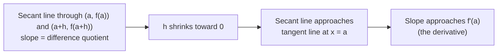
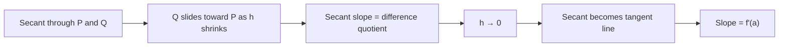

# SPL Run: build_concept_book

- **Adapter:** claude_cli
- **Model:** claude-sonnet-5
- **Tokens:** 9032 in / 4809 out
- **Latency:** 118692ms
- **Timestamp:** 2026-09-27 12:21:48

## Output

```output


---

## Difference Quotient

For a function $f$, the **difference quotient** measures the average rate of change of $f$ over an interval. Two equivalent forms are used depending on context:

$$\frac{f(x) - f(a)}{x - a} \qquad \text{or} \qquad \frac{f(a+h) - f(a)}{h}$$

Geometrically, this ratio is the slope of the **secant line** connecting the points $(a, f(a))$ and $(x, f(x))$ (or $(a+h, f(a+h))$) on the graph of $f$. It answers the question: "on average, how fast did $f$ change between these two inputs?" The difference quotient is the algebraic bridge to the derivative — letting $h \to 0$ turns an *average* rate of change into an *instantaneous* one, which is precisely how the derivative is defined: $f'(a) = \lim_{h \to 0} \frac{f(a+h)-f(a)}{h}$.

**Worked example.** Let $f(x) = x^2 + 1$ and $a = 3$. Compute the difference quotient using the $h$-form:

$$\frac{f(3+h) - f(3)}{h} = \frac{(3+h)^2 + 1 - (9+1)}{h} = \frac{9 + 6h + h^2 + 1 - 10}{h} = \frac{6h + h^2}{h} = 6 + h$$

For $h = 1$, the average rate of change from $x=3$ to $x=4$ is $7$. As $h$ shrinks toward $0$, the expression $6+h$ approaches $6$, matching $f'(3) = 2(3) = 6$ from the power rule. This algebraic simplification step — canceling the factor of $h$ before taking the limit — is the core technique for computing derivatives directly from the limit definition, since plugging in $h=0$ before simplifying gives the indeterminate form $0/0$.

**Problem-solving application.** The difference quotient is the standard tool for finding derivatives from first principles and for estimating rates of change from tabulated (non-formulaic) data, such as measured velocity from position readings at two nearby times. When simplifying $\frac{f(a+h)-f(a)}{h}$ for polynomials, always expand fully, combine like terms, and factor out $h$ from the numerator before canceling — this avoids errors and reveals the limiting behavior as $h \to 0$.



*As $h \to 0$, the secant line's slope (the difference quotient) converges to the tangent line's slope (the derivative).*

---

## Limit

The limit formalizes what it means for a function's output to get arbitrarily close to a value $L$ as the input $x$ approaches a point $a$, written

$$\lim_{x \to a} f(x) = L.$$

Formally, this means: for every $\varepsilon > 0$, there exists a $\delta > 0$ such that whenever $0 < |x - a| < \delta$, it follows that $|f(x) - L| < \varepsilon$. In words, we can force $f(x)$ to lie within any tolerance $\varepsilon$ of $L$ by restricting $x$ to lie close enough (within $\delta$) to $a$ — without ever requiring $x = a$. This last point is essential: a limit describes behavior *near* $a$, not the value *at* $a$, which is what makes limits the right tool for handling points where a function is undefined or discontinuous, such as division by zero in a difference quotient.

**Worked example.** Consider $f(x) = \dfrac{x^2 - 4}{x - 2}$, which is undefined at $x = 2$. Direct substitution gives $\frac{0}{0}$, an indeterminate form — but the limit still exists. Factor the numerator:

$$\frac{x^2-4}{x-2} = \frac{(x-2)(x+2)}{x-2} = x+2, \quad x \neq 2.$$

Since the simplified expression agrees with $f$ everywhere except at $x=2$, and limits ignore the value at the point itself,

$$\lim_{x \to 2} \frac{x^2-4}{x-2} = \lim_{x\to 2}(x+2) = 4.$$

Graphically, $f$ has a "hole" at $(2,4)$, but the limit exists and equals 4 anyway.

**Problem-solving application.** Limits are the gateway to the derivative. The instantaneous rate of change of $f$ at $a$ is defined as

$$f'(a) = \lim_{h \to 0} \frac{f(a+h) - f(a)}{h},$$

which is itself a $\frac{0}{0}$ indeterminate form resolved by algebraic simplification before taking the limit — exactly the technique practiced above. Whenever a limit produces $\frac{0}{0}$ or a similar indeterminate form, the same instinct applies: manipulate the expression algebraically (factor, expand, rationalize) until the offending term cancels, then substitute. Mastering this evaluation skill — recognizing indeterminate forms and clearing them through algebra — is therefore not an isolated exercise but the computational foundation on which the derivative, and everything built from it, depends.

---

## Derivative At A Point

The derivative of $f$ at $a$, written $f'(a)$, measures the instantaneous rate of change of $f$ at that single point. It is defined as the limit of a *difference quotient*:

$$f'(a) = \lim_{h \to 0} \frac{f(a+h) - f(a)}{h}$$

or equivalently, letting $x = a + h$:

$$f'(a) = \lim_{x \to a} \frac{f(x) - f(a)}{x - a}$$

Each ratio $\frac{f(a+h)-f(a)}{h}$ is the slope of a *secant line* connecting the points $(a, f(a))$ and $(a+h, f(a+h))$. As $h$ shrinks toward zero, the secant line pivots and settles into the *tangent line* at $a$, whose slope is exactly $f'(a)$. The limit is essential here — plugging in $h = 0$ directly gives $\frac{0}{0}$, an undefined expression, so the derivative captures a limiting behavior, not a single computable ratio.

**Worked example.** Let $f(x) = x^2$ and find $f'(3)$.

$$f'(3) = \lim_{h \to 0} \frac{(3+h)^2 - 3^2}{h} = \lim_{h \to 0} \frac{9 + 6h + h^2 - 9}{h} = \lim_{h \to 0} \frac{6h + h^2}{h}$$

Factor out $h$ from the numerator (valid since $h \neq 0$ as it approaches zero, not equal to it):

$$= \lim_{h \to 0} (6 + h) = 6$$

So $f'(3) = 6$: at $x = 3$, the curve $y = x^2$ is rising with slope 6, and the tangent line there is $y - 9 = 6(x - 3)$.

**Problem-solving application.** Derivatives at a point let you answer "how fast, right now?" questions. If $s(t) = 4.9t^2$ gives the distance (meters) fallen by an object after $t$ seconds, then $s'(2)$ gives its instantaneous speed at $t = 2$: compute $\lim_{h\to 0} \frac{4.9(2+h)^2 - 4.9(2)^2}{h}$, which simplifies to $19.6$ m/s. This same limit process underlies marginal cost in economics, instantaneous velocity in physics, and the slope of any tangent line — whenever you need a rate of change at an exact moment rather than an average over an interval.


*As $h$ shrinks toward zero, the secant line's slope converges to the slope of the tangent line — the derivative at that point.*

---

## Secant Line

A secant line is a line that passes through two distinct points on a curve. Given a function $f$ and two points $x = a$ and $x = a+h$ on its domain (with $h \neq 0$), the secant line connects $(a, f(a))$ and $(a+h, f(a+h))$. Its slope is given by the **difference quotient**:

$$
m_{\text{sec}} = \frac{f(a+h) - f(a)}{h}
$$

This slope represents the **average rate of change** of $f$ over the interval $[a, a+h]$ — how much the function's output changes, on average, per unit change in input. Unlike a tangent line, which touches the curve at a single point and captures instantaneous behavior, a secant line always requires two points and describes change over an interval.

**Worked example.** Let $f(x) = x^2$, with $a = 1$ and $h = 2$, so the second point is $x = 3$.

$$
m_{\text{sec}} = \frac{f(3) - f(1)}{3 - 1} = \frac{9 - 1}{2} = 4
$$

The secant line through $(1, 1)$ and $(3, 9)$ has slope 4. Using point-slope form, its equation is $y - 1 = 4(x - 1)$, or $y = 4x - 3$. This line approximates how steeply the parabola rises between $x=1$ and $x=3$, though the curve itself is steeper near $x=3$ and less steep near $x=1$ — the secant slope is an *average*, smoothing out that variation.

**Problem-solving application.** Secant lines are the foundation for computing instantaneous rates of change. If you shrink the interval — letting $h \to 0$ — the secant line's slope approaches the slope of the tangent line at $x = a$, which is the derivative $f'(a)$. This is precisely why the difference quotient appears in the formal definition of the derivative:

$$
f'(a) = \lim_{h \to 0} \frac{f(a+h) - f(a)}{h}
$$

In practice, secant lines are useful even without taking a limit: physicists use them to estimate average velocity from position data at two times, and economists use them to estimate average growth rate between two data points. Whenever you only have discrete measurements rather than a continuous formula, the secant slope is often the best rate-of-change estimate available — and computing it well is a prerequisite skill before tackling limits and derivatives.

---

## Instantaneous Rate Of Change

The average rate of change of a function $f$ over an interval $[a, a+h]$ is the familiar slope of a secant line:
$$\frac{f(a+h) - f(a)}{h}.$$
This tells you how much $f$ changes *on average* across that interval — but it says nothing about the behavior at any single instant. To capture the rate of change exactly at $x = a$, we shrink the interval to zero width by taking a limit:
$$f'(a) = \lim_{h \to 0} \frac{f(a+h) - f(a)}{h}.$$
This quantity, the **instantaneous rate of change** (equivalently, the derivative of $f$ at $a$), is the slope of the tangent line to the graph of $f$ at the point $(a, f(a))$. It exists only if the limit exists — if the secant slopes settle down to a single value as $h \to 0$ from both directions.

**Worked example.** Let $f(x) = x^2$, and find the instantaneous rate of change at $a = 3$.
$$f'(3) = \lim_{h \to 0} \frac{(3+h)^2 - 3^2}{h} = \lim_{h \to 0} \frac{9 + 6h + h^2 - 9}{h} = \lim_{h \to 0} (6 + h) = 6.$$
So at $x = 3$, $f$ is instantaneously increasing at a rate of 6 units of output per unit of input — much faster than at, say, $a = 0.5$, where $f'(0.5) = 1$. The derivative varies with $a$, reflecting how steepness changes across the curve.

**Problem-solving application.** Suppose $f(t) = -4.9t^2 + 20t$ gives the height (in meters) of a projectile $t$ seconds after launch. The average velocity over $[1,2]$ is $\frac{f(2)-f(1)}{1} = \frac{20.4 - 15.1}{1} = 5.3$ m/s — but the object's *actual* speed is constantly changing due to gravity. To find the instantaneous velocity at $t=1$ (the reading a speedometer would show at that exact moment), compute
$$f'(1) = \lim_{h\to 0} \frac{f(1+h)-f(1)}{h} = -9.8(1) + 20 = 10.2 \text{ m/s}.$$
This distinction — average versus instantaneous rate — is the reason derivatives are indispensable: velocity, marginal cost, population growth rate, and reaction rate are all instantaneous rates of change, not averages, and the limit definition is what makes them mathematically precise rather than approximate.

---

## Tangent Line

The tangent line to a curve $y = f(x)$ at a point $P = (a, f(a))$ is the straight line that best approximates the curve near $P$ — it touches the curve at that point and points in the same instantaneous direction the curve is heading. To make this precise, start with something easier to compute: a **secant line**, which passes through two points on the curve, $P = (a, f(a))$ and $Q = (a+h, f(a+h))$. The slope of this secant is the familiar difference quotient:

$$
m_{\text{sec}} = \frac{f(a+h) - f(a)}{h}.
$$

As $h \to 0$, the point $Q$ slides along the curve toward $P$, and the secant line rotates until it settles into the tangent line. The slope of the tangent is defined as the limit of the secant slopes:

$$
m_{\text{tan}} = \lim_{h \to 0} \frac{f(a+h) - f(a)}{h} = f'(a).
$$

This limit is precisely the derivative of $f$ at $a$ — the tangent line is the geometric meaning of the derivative.

**Worked example.** Find the tangent line to $f(x) = x^2$ at $a = 3$.

First compute the slope: $f'(x) = 2x$, so $f'(3) = 6$. The point of tangency is $(3, f(3)) = (3, 9)$. Using point-slope form:

$$
y - 9 = 6(x - 3) \quad \Longrightarrow \quad y = 6x - 9.
$$

**Problem-solving application.** Tangent lines are the standard tool for *local linear approximation*: near $x = a$, $f(x) \approx f(a) + f'(a)(x-a)$. For instance, to estimate $\sqrt{4.1}$ without a calculator, let $f(x) = \sqrt{x}$, $a = 4$. Then $f(4) = 2$, $f'(x) = \frac{1}{2\sqrt{x}}$, so $f'(4) = 0.25$. The tangent line gives $\sqrt{4.1} \approx 2 + 0.25(0.1) = 2.025$ — very close to the true value $2.0248\ldots$. This same idea underlies Newton's method for root-finding and error estimation in physics and engineering.


*As the second point $Q$ slides toward $P$ along the curve, the secant line rotates and converges to the tangent line, with slope given by the limit $\lim_{h\to 0}$ of the difference quotient.*

---

## Velocity

Velocity is the instantaneous rate of change of an object's position with respect to time, formally defined as the derivative of the position function:

$$v(t) = \frac{dx}{dt} = \lim_{\Delta t \to 0} \frac{x(t + \Delta t) - x(t)}{\Delta t}$$

Unlike average velocity, which measures displacement over a finite time interval, instantaneous velocity captures the object's motion at a single moment. This distinction matters because average velocity can mask important behavior — an object might average zero velocity over a trip while moving quickly in both directions. The derivative eliminates this ambiguity by shrinking the interval to zero, isolating the object's behavior at exactly one instant.

**Worked example.** Suppose a particle moves along a line with position function $x(t) = 3t^2 - 2t + 1$ (meters, with $t$ in seconds). To find velocity, differentiate:

$$v(t) = \frac{dx}{dt} = 6t - 2$$

At $t = 2$ seconds, $v(2) = 6(2) - 2 = 10$ m/s. Note that $v(t)$ is itself a function of time — the particle's velocity changes continuously as $t$ changes, which is precisely what differentiation captures that a single average-velocity calculation cannot.

**Problem-solving application.** Velocity analysis becomes essential when position is nonlinear, since the rate of change itself varies. Consider $x(t) = t^3 - 6t^2 + 9t$. Setting $v(t) = 3t^2 - 12t + 9 = 0$ and solving gives $t = 1$ and $t = 3$ — the instants when the particle momentarily stops before reversing direction. This technique, finding critical points of velocity, underlies motion analysis in physics (projectile turning points), economics (marginal rate transitions), and any application where identifying moments of zero rate of change reveals structural behavior in a system. Mastering the derivative relationship between position and velocity is the foundation for later extending to acceleration, $a(t) = dv/dt$, and for solving kinematics problems where velocity, not position, is the given or sought quantity.

---

## Payoff

Velocity is the concept where kinematics stops being descriptive and becomes predictive. Position tells you where something is; velocity tells you how that position is changing and, crucially, lets you anticipate where it will be next. Formally, velocity is the time derivative of position, $v(t) = \dfrac{dx}{dt}$, a vector quantity carrying both magnitude (speed) and direction. This derivative relationship is the payoff of everything that precedes it: without a rigorous notion of position as a function of time, and without the limiting process that defines a derivative, $v(t) = \lim_{\Delta t \to 0} \dfrac{x(t+\Delta t) - x(t)}{\Delta t}$, velocity would be no more than an average — a coarse ratio of distance over elapsed time. The derivative sharpens that ratio into an instantaneous, exact statement about motion at a single moment, which is what makes physics and engineering problems tractable rather than merely descriptive.

**Worked example.** A drone's altitude is given by $x(t) = 4t^2 + 2t$ meters. Its instantaneous velocity is $v(t) = \dfrac{dx}{dt} = 8t + 2$ m/s. At $t = 3\text{ s}$, $v(3) = 26$ m/s — not an average over some interval, but the exact rate of ascent at that instant, the number a flight controller needs to decide whether to throttle up or down right now.

Velocity is the natural endpoint of this book's arc because it is the first quantity that requires calculus to define correctly, and once you have it, an entire new layer of motion analysis opens up. The clearest example is acceleration, $a(t) = \dfrac{dv}{dt}$, the rate at which velocity itself changes. Acceleration cannot be defined without velocity any more than velocity can be defined without position — it is the same derivative operation applied one level higher, turning "how fast is it moving" into "how is its motion changing." This is why Newton's second law, $F = ma$, is really a statement about the second derivative of position: force governs acceleration, acceleration governs velocity, and velocity governs position, each layer built rigorously on the one below it.

From here, the natural next step is to take the derivative one level higher: define acceleration formally, compute it from a velocity function, and see how a changing velocity — not just a nonzero one — is what force actually produces.
```
