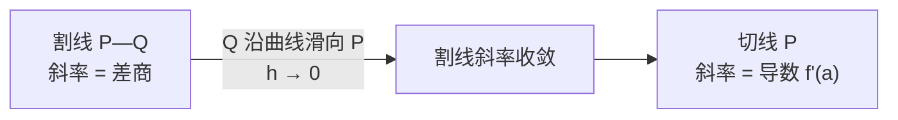

# SPL Run: build_concept_book

- **Adapter:** claude_cli
- **Model:** claude-sonnet-5
- **Tokens:** 8004 in / 2092 out
- **Latency:** 128126ms
- **Timestamp:** 2026-09-27 20:07:08

## Output

```output


---

## Difference Quotient

**定义**

设函数 $f$ 在包含点 $a$ 的区间上有定义，差商（difference quotient）定义为：

$$\frac{f(x) - f(a)}{x - a}, \qquad x \neq a$$

若令 $x = a + h$，则等价地写作：

$$\frac{f(a+h) - f(a)}{h}, \qquad h \neq 0$$

这个比值的几何意义是：函数图像上两点 $(a, f(a))$ 与 $(x, f(x))$ 之间连线（割线）的斜率。它衡量的是 $f$ 在区间 $[a, x]$（或 $[a, a+h]$）上的**平均变化率**——自变量每变化一个单位，函数值平均变化多少。差商本身不涉及极限，它是一个纯代数运算，对任意固定的 $h \neq 0$ 都有定义；当 $h \to 0$ 时它才逼近瞬时变化率（导数），但那是下一个概念要讨论的内容。

**例题**

设 $f(x) = x^2 + 1$，$a = 2$。计算差商 $\dfrac{f(2+h) - f(2)}{h}$。

先展开分子：

$$f(2+h) = (2+h)^2 + 1 = 4 + 4h + h^2 + 1 = h^2 + 4h + 5$$

$$f(2) = 2^2 + 1 = 5$$

于是

$$\frac{f(2+h) - f(2)}{h} = \frac{h^2 + 4h + 5 - 5}{h} = \frac{h^2 + 4h}{h} = \frac{h(h+4)}{h} = h + 4$$

（$h \neq 0$ 时可约去公因子 $h$）。例如取 $h = 1$，差商为 $5$，对应割线连接 $(2,5)$ 与 $(3,10)$，验证斜率 $=\frac{10-5}{3-2}=5$，与结果一致。

**问题求解应用**

差商的核心价值在于：它把"变化率"从需要精确瞬时速度的问题，转化为一个可以直接代数计算的量。典型应用场景：

- **物理**：若 $s(t)$ 是位置函数，$\dfrac{s(t+h)-s(t)}{h}$ 就是从 $t$ 到 $t+h$ 这段时间内的平均速度。
- **经济**：若 $C(x)$ 是生产 $x$ 件产品的总成本，差商给出从 $x$ 到 $x+h$ 单位产量区间的平均边际成本。
- **数值逼近**：在无法解析求导时（如实验数据、复杂函数），可用较小的 $h$ 计算差商作为导数的近似值。

求解这类问题的标准步骤是：写出 $f(a+h)$ 的展开式 → 减去 $f(a)$ → 除以 $h$ → 化简（通常需要约去分子中的公因子 $h$，这一步是为后续讨论 $h \to 0$ 极限扫清代数障碍）。掌握这个化简技巧，是理解导数定义的必要准备。

---

## 极限

**定义**

极限（limit）描述当自变量 $x$ 无限接近某一点 $a$ 时，函数 $f(x)$ 所趋近的值，记作：
$$\lim_{x \to a} f(x) = L$$

这并不要求 $f(a)$ 本身存在或等于 $L$，只关心 $x$ 靠近 $a$ 时函数值的趋势。严格定义（$\varepsilon$-$\delta$ 定义）为：对任意 $\varepsilon > 0$，存在 $\delta > 0$，使得当 $0 < |x - a| < \delta$ 时，恒有 $|f(x) - L| < \varepsilon$。换句话说，只要把 $x$ 限制得足够靠近 $a$（但不等于 $a$），就能让 $f(x)$ 任意接近 $L$。极限是微积分的基石：导数（瞬时变化率）和积分（连续求和）都建立在极限运算之上。

**范例**

考虑 $f(x) = \dfrac{x^2 - 1}{x - 1}$。在 $x = 1$ 处，函数本身没有定义（分母为零）。但因式分解得：
$$f(x) = \frac{(x-1)(x+1)}{x-1} = x + 1 \quad (x \neq 1)$$

所以当 $x \to 1$ 时，$f(x) \to 2$，即
$$\lim_{x \to 1} \frac{x^2 - 1}{x - 1} = 2$$

图像上看，这是一条直线 $y = x+1$，只是在 $x=1$ 处挖去了一个点——极限告诉我们，即使这一点“缺失”，函数仍然明确地趋向 $2$。

**问题解决应用**

极限的核心用途是处理“$\frac{0}{0}$”型的不定式，这类表达式无法直接代入求值，必须通过代数变形（因式分解、有理化、通分）消去零因子后再取极限。例如求
$$\lim_{x \to 0} \frac{\sqrt{x+4} - 2}{x}$$
分子分母同乘以共轭式 $\sqrt{x+4}+2$，化简得
$$\lim_{x \to 0} \frac{1}{\sqrt{x+4}+2} = \frac{1}{4}$$

这一技巧正是导数定义 $f'(a) = \lim_{h \to 0} \dfrac{f(a+h)-f(a)}{h}$ 的核心步骤：先构造出恒为 $\frac{0}{0}$ 型的差商，再通过代数化简求出真实的变化率。掌握极限的计算，是理解瞬时速度、切线斜率乃至一切“连续变化”问题的必经之路。

---

## Derivative At A Point

**定义**

设函数 $f$ 在点 $a$ 附近有定义。$f$ 在 $a$ 处的导数，记作 $f'(a)$，定义为差商的极限：

$$
f'(a) = \lim_{h \to 0} \frac{f(a+h) - f(a)}{h}
$$

等价地，令 $x = a + h$，也可以写成：

$$
f'(a) = \lim_{x \to a} \frac{f(x) - f(a)}{x - a}
$$

这个极限的几何意义是：连接曲线上两点 $(a, f(a))$ 和 $(a+h, f(a+h))$ 的割线，其斜率恰好就是差商 $\dfrac{f(a+h)-f(a)}{h}$。当 $h \to 0$ 时，第二个点沿曲线滑向第一个点，割线逐渐逼近曲线在 $a$ 处的切线，$f'(a)$ 就是这条切线的斜率。如果这个极限不存在（比如函数在 $a$ 处有尖角、间断或垂直切线），就说 $f$ 在 $a$ 处不可导。

**例题**

求 $f(x) = x^2$ 在 $a = 3$ 处的导数。

按定义代入：

$$
f'(3) = \lim_{h \to 0} \frac{(3+h)^2 - 3^2}{h} = \lim_{h \to 0} \frac{9 + 6h + h^2 - 9}{h} = \lim_{h \to 0} \frac{6h + h^2}{h} = \lim_{h \to 0}(6+h) = 6
$$

所以 $f'(3) = 6$，即曲线 $y = x^2$ 在点 $(3, 9)$ 处的切线斜率为 $6$，切线方程为 $y - 9 = 6(x-3)$。

**解题应用**

导数在一点处的定义不仅是计算工具，更是分析瞬时变化率的基础：物理中的瞬时速度是位置函数在某时刻的导数，经济中的边际成本是成本函数在某产量处的导数。做题时，若直接用极限定义计算较繁琐，可先展开差商、化简分子中的公因子 $h$，再令 $h \to 0$；若遇到分母含根号，通常需要有理化处理。掌握这一点定义是后续学习导数函数 $f'(x)$（即在每一点都求一次此极限）的必要前提。


*图示：割线斜率 $\dfrac{f(x+h)-f(x)}{h}$ 随 $h \to 0$ 逐步逼近切线，即该点处的导数。*

---

## Secant Line

割线（secant line）是穿过曲线上两个不同点的直线，用来度量函数在这两点之间的**平均变化率**。设函数 $f$ 在区间上有定义，取曲线上两点 $(a, f(a))$ 和 $(a+h, f(a+h))$，其中 $h \neq 0$ 是横坐标的增量。这条割线的斜率由**差商**（difference quotient）给出：

$$
m_{\text{sec}} = \frac{f(a+h) - f(a)}{h}
$$

这个比值的几何意义是"纵坐标的变化量除以横坐标的变化量"，物理意义则是平均速度、平均增长率等。差商的重要性在于：当 $h \to 0$ 时，它正是导数（瞬时变化率）的定义式，因此割线是理解切线与导数概念不可或缺的中间桥梁。

**范例。** 设 $f(x) = x^2$，考虑 $a = 1$，$h = 2$（即两点为 $(1,1)$ 和 $(3,9)$）。差商为

$$
m_{\text{sec}} = \frac{f(3) - f(1)}{3 - 1} = \frac{9 - 1}{2} = 4
$$

于是割线方程可用点斜式写出：$y - 1 = 4(x - 1)$，即 $y = 4x - 3$。这条直线穿过曲线上的两个真实交点，其斜率 $4$ 表示 $x$ 从 $1$ 增加到 $3$ 时，$f(x)$ 的平均变化率。

**问题求解应用。** 割线最重要的应用是估计瞬时变化率并逼近切线。取固定点 $a=1$，让 $h$ 逐渐减小，观察斜率序列如何收敛：

- $h = 1$：两点 $(1,1)$、$(2,4)$，斜率 $= \dfrac{4-1}{1} = 3$
- $h = 0.1$：两点 $(1,1)$、$(1.1,1.21)$，斜率 $= \dfrac{1.21-1}{0.1} = 2.1$
- $h = 0.01$：斜率 $\approx 2.01$

可以看到，随着 $h \to 0$，割线斜率趋近于 $2$，这正是 $f(x)=x^2$ 在 $x=1$ 处的导数值 $f'(1) = 2$。这一过程展示了极限如何把"平均变化率"精化为"瞬时变化率"——切线正是割线在 $h \to 0$ 时的极限位置。在实际问题中，例如从实验数据估算速度或反应速率时，若只掌握离散的两点数据，割线斜率便是唯一可计算的近似值；缩短取样间隔 $h$ 则能提高逼近精度，这也是数值微分方法的理论基础。

---

## Instantaneous Rate Of Change

**定义**

函数 $f$ 在某一点 $a$ 处的**瞬时变化率**，就是导数 $f'(a)$，它衡量的是 $f$ 在 $x=a$ 这一"瞬间"变化的快慢。与之相对的是**平均变化率**，即在区间 $[a, a+h]$ 上函数值变化量与自变量变化量之比：

$$\frac{f(a+h) - f(a)}{h}$$

当区间长度 $h$ 不断缩小、趋于 $0$ 时，平均变化率会逼近一个极限值，这个极限就是瞬时变化率：

$$f'(a) = \lim_{h \to 0} \frac{f(a+h) - f(a)}{h}$$

几何上，平均变化率是割线的斜率，而瞬时变化率是当割线绕点 $a$ 旋转、最终变成切线时的斜率。物理上，如果 $f(t)$ 表示位置随时间的变化，那么平均变化率是平均速度，瞬时变化率就是某一时刻的**瞬时速度**。

**范例求解**

设 $f(t) = t^2 + 3t$ 表示某物体的位置（单位：米），求 $t=2$ 秒时的瞬时速度。

先计算平均变化率：

$$\frac{f(2+h) - f(2)}{h} = \frac{(2+h)^2 + 3(2+h) - (4+6)}{h} = \frac{4h + h^2 + 3h}{h} = 7 + h$$

令 $h \to 0$：

$$f'(2) = \lim_{h \to 0} (7 + h) = 7 \text{ 米/秒}$$

因此在 $t=2$ 秒时，物体的瞬时速度为每秒 7 米——这正是位置函数图像在该点切线的斜率。

**问题解决应用**

瞬时变化率的意义远不止求斜率，它是分析"变化中的变化"的基本工具。例如在经济学中，成本函数 $C(x)$ 在产量 $x$ 处的导数 $C'(x)$ 称为**边际成本**，代表多生产一单位产品所增加的成本，用于决定是否值得扩大生产。在生物学中，种群数量 $P(t)$ 的导数 $P'(t)$ 表示种群的瞬时增长率，可用来预测资源是否会被耗尽。求解这类问题的关键步骤是：先写出精确的函数表达式，再对其求导（或用极限定义直接计算），最后将导数值代入具体的点，并结合实际背景解释其单位和含义（如"米/秒"、"元/件"）。掌握这一转换过程——从平均到瞬时、从割线到切线——是理解微积分如何刻画连续变化世界的核心一步。

---

## 切线

设函数 $f$ 在点 $x=a$ 处有定义。过曲线 $y=f(x)$ 上两点 $P(a, f(a))$ 与 $Q(a+h, f(a+h))$ 的直线称为**割线**，其斜率为差商

$$
m_{\text{sec}} = \frac{f(a+h)-f(a)}{h}.
$$

当 $Q$ 沿曲线滑向 $P$ 时，即 $h \to 0$，割线的斜率若趋于一个确定的极限值，这个极限位置的直线就称为曲线在点 $P$ 处的**切线**，其斜率定义为

$$
m_{\tan} = \lim_{h \to 0} \frac{f(a+h)-f(a)}{h}.
$$

这个极限正是导数 $f'(a)$ 的定义——切线斜率与导数是同一个数，只是几何与代数两种视角。切线方程可写为点斜式：

$$
y - f(a) = f'(a)\,(x-a).
$$

**范例。** 求 $f(x)=x^2$ 在 $a=1$ 处的切线方程。

先算差商：
$$
\frac{f(1+h)-f(1)}{h} = \frac{(1+h)^2-1}{h} = \frac{2h+h^2}{h} = 2+h.
$$

令 $h\to 0$，得 $f'(1)=2$。又 $f(1)=1$，所以切线方程为

$$
y - 1 = 2(x-1) \quad\Longrightarrow\quad y = 2x - 1.
$$

**解题应用。** 切线的核心用途是**局部线性近似**：在 $a$ 附近，曲线几乎与切线重合，故

$$
f(a+\Delta x) \approx f(a) + f'(a)\,\Delta x.
$$

例如估计 $\sqrt{4.02}$：取 $f(x)=\sqrt{x}$，$a=4$，$f(4)=2$，$f'(x)=\dfrac{1}{2\sqrt{x}}$，故 $f'(4)=\dfrac14$。于是

$$
\sqrt{4.02} \approx 2 + \frac14(0.02) = 2.005,
$$

与真实值 $2.0049938\ldots$ 高度接近。这种"用切线代替曲线"的思想，正是后续学习微分近似、牛顿迭代法求根、以及优化问题中判断极值的基础。


*图示：随着第二点 $Q$ 沿曲线趋近第一点 $P$（$h\to 0$），割线的斜率逐渐收敛为切线的斜率。*

理解切线不仅是几何直觉，更是微积分中"用简单（线性）对象逼近复杂（曲线）对象"这一核心策略的第一个具体实例。

---

## Velocity

**定义**

速度（velocity）是物体位置函数关于时间的瞬时变化率。设位置函数为 $x(t)$，则瞬时速度定义为

$$v(t) = \frac{dx}{dt} = \lim_{\Delta t \to 0} \frac{x(t+\Delta t) - x(t)}{\Delta t}$$

需要区分速度与速率（speed）：速度是矢量，既有大小也有方向（在一维运动中用正负号表示方向），而速率是速度的绝对值 $|v(t)|$，只表示快慢。这一区别在物理和工程问题中至关重要——一个物体速率不变但方向改变（如匀速圆周运动），其速度却在不断变化。

**范例**

设某物体沿直线运动，位置函数为 $x(t) = t^3 - 6t^2 + 9t$（单位：米，$t$ 单位：秒）。对其求导得速度函数：

$$v(t) = x'(t) = 3t^2 - 12t + 9$$

在 $t=0$ 时，$v(0) = 9$ m/s，物体向正方向运动。令 $v(t) = 0$，解得 $3t^2 - 12t + 9 = 0$，即 $t^2 - 4t + 3 = 0$，因式分解得 $(t-1)(t-3) = 0$，故 $t=1$ s 和 $t=3$ s 时速度为零——这正是物体运动方向反转的瞬间（速度由正变负，再由负变正）。

**问题求解应用**

判断物体何时"前进"、何时"后退"是运动学分析的核心技能：只需分析 $v(t)$ 的符号。在本例中，$t \in (1,3)$ 区间内 $v(t) < 0$（可代入 $t=2$ 验证：$v(2) = 12-24+9=-3 < 0$），说明此区间物体反向运动；而在 $t \in (0,1)$ 和 $t \in (3,\infty)$ 区间，$v(t) > 0$，物体沿正方向运动。

这种"求导找零点、划分符号区间"的方法，是解决一切一维运动方向分析问题的通用步骤：先对位置函数求导得到速度函数，再解 $v(t)=0$ 找到临界时刻，最后用测试点确定各区间的运动方向。这一技巧同样适用于加速度分析（对 $v(t)$ 再求导）及后续学习的运动图像判读。

---

## Payoff

速度这一概念之所以成为本章的落脚点，是因为它第一次把"位置如何随时间变化"这件事变成了一个可以精确计算、可以预测的量。速度不是简单地告诉我们物体在哪里，而是告诉我们物体正在如何离开当前的位置——它是位置对时间的变化率。数学上，平均速度定义为

$$
\bar{v} = \frac{\Delta x}{\Delta t} = \frac{x(t_2) - x(t_1)}{t_2 - t_1}
$$

而当我们让时间间隔 $\Delta t \to 0$ 时，就得到了瞬时速度：

$$
v(t) = \lim_{\Delta t \to 0} \frac{x(t+\Delta t) - x(t)}{\Delta t} = \frac{dx}{dt}
$$

这个极限运算正是微积分中导数的定义，速度因此成为连接几何直观（位置-时间图像的斜率）与代数工具（求导）的桥梁。理解了这一点，学生就掌握了描述任何连续变化过程的通用语言，而不仅仅是运动学中的一个公式。

举一个具体例子：设某质点的位置函数为 $x(t) = 3t^2 + 2t$（单位为米，$t$ 单位为秒）。对其求导得瞬时速度 $v(t) = 6t + 2$。在 $t=2$ 秒时，$v(2) = 14$ 米/秒。这个结果不是通过测量两个点之间的平均斜率近似得到的，而是精确的、任意时刻都成立的表达式——这正是速度作为导数概念的力量所在。

速度自然地打开了通往加速度的大门。既然速度本身是位置随时间的变化率，那么一个同样自然的问题是：速度自身是否也在变化？如果速度在变化，变化的快慢又该如何描述？答案就是加速度，它被定义为速度对时间的导数：

$$
a(t) = \frac{dv}{dt} = \frac{d^2x}{dt^2}
$$

这说明加速度不过是将求导这一操作在速度的基础上再应用一次——同一套数学工具，被递归地用于描述更深一层的变化。掌握了速度，你已经具备了理解加速度、乃至更高阶变化率所需的全部概念基础和运算技能。

接下来，不妨深入探究加速度这一应用领域：它如何解释自由落体、抛体运动，乃至牛顿第二定律中力与运动之间的本质联系。
```
